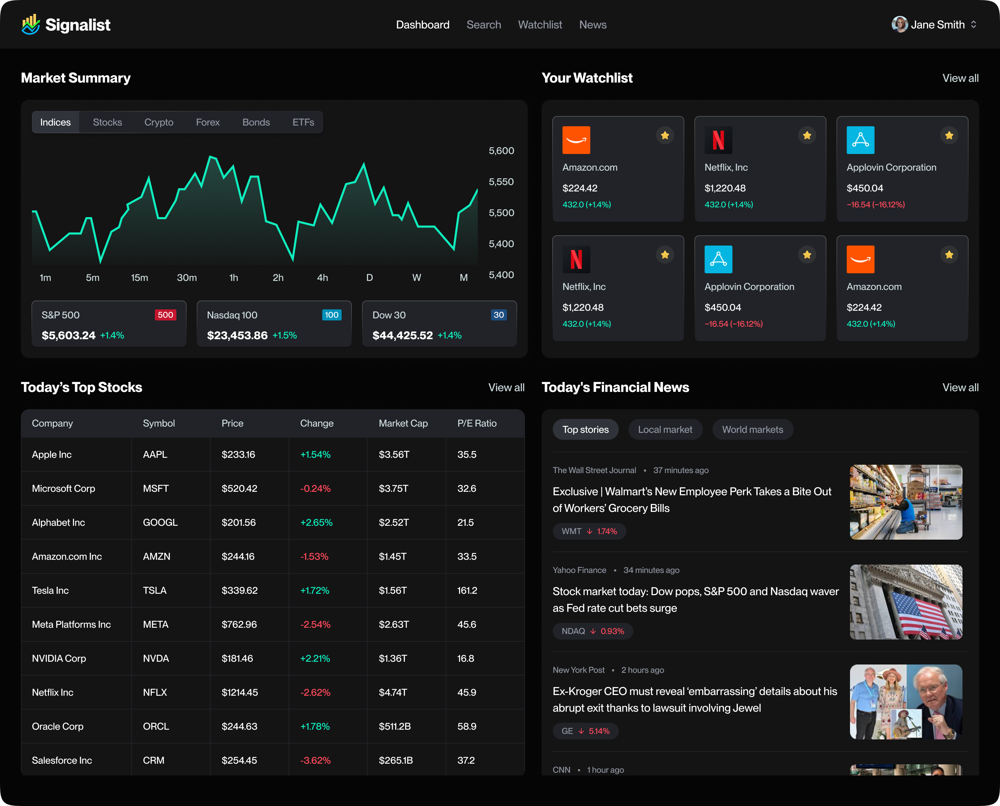

# Signalist - Stock Market Analytics


A real-time stock market analytics platform built with Next.js, featuring market summaries, personalized watchlists, and curated financial news.

## Features

- **Market Summary**: Interactive charts displaying real-time market data across major indices (S&P 500, Nasdaq 100, Dow 30)
- **Personalized Watchlist**: Track your favorite stocks with live price updates and performance metrics
- **Top Stocks**: View today's top-performing stocks with detailed metrics including price, change, market cap, and P/E ratio
- **Financial News**: Curated financial news from top sources with categorization by market segments
- **Authentication**: Secure user authentication powered by Better Auth
- **Email Notifications**: Daily news summaries delivered via Nodemailer
- **Dark Mode**: Theme support with next-themes



## Tech Stack

- **Framework**: Next.js 15.5.6 with React 19
- **Database**: MongoDB with Mongoose ODM
- **Authentication**: Better Auth
- **UI Components**: Radix UI primitives
- **Styling**: Tailwind CSS 4
- **Background Jobs**: Inngest
- **Email**: Nodemailer
- **Icons**: Lucide React

## Getting Started

### Prerequisites

- Node.js 20+
- MongoDB instance
- Environment variables (see `.env.example`)

### Installation

1. Clone the repository
2. Install dependencies:

```bash
npm install
# or
bun install
```

3. Set up environment variables
4. Run the development server:

```bash
npm run dev
# or
bun dev
```

Open [http://localhost:3000](http://localhost:3000) to view the application.

## Development

- `npm run dev` - Start development server with Turbopack
- `npm run build` - Build for production
- `npm run start` - Start production server
- `npm run lint` - Run ESLint

## Deploy on Vercel

The easiest way to deploy is using the [Vercel Platform](https://vercel.com/new).

[](https://vercel.com/new/clone?repository-url=https://github.com/your-username/stock-market-analytics)

## TODO

- Watchlist
- Alerts
